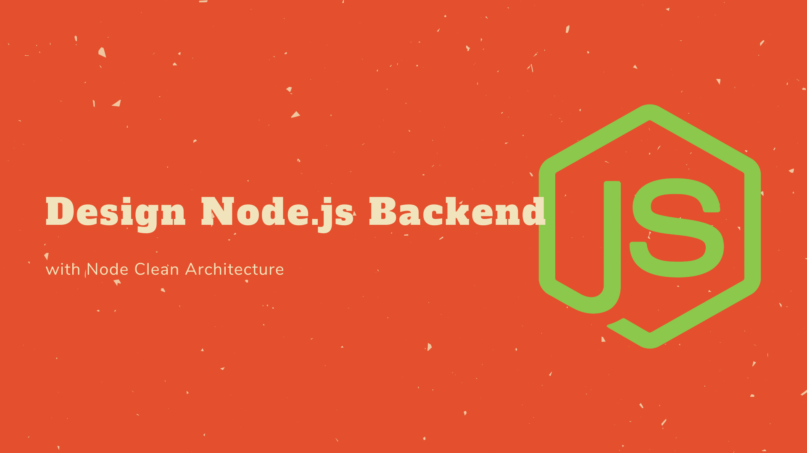

## Getting Started



Before you go, [you can visit demo here.](http://itmin.unlocksth.site)

### Main features

| Id  | Title                   | Description                              | Remark |
| --- | ----------------------- | ---------------------------------------- | ------ |
| 1   | Admin Dashboard         | Design CMS using Bootstrap v4            |        |
| 2   | Menu Permission         | Access menu based on user role           |        |
| 3   | Custom Theme            | Switch theme (defaut, sports, etc)       |        |
| 4   | AuthN, AuthZ            | Protect API with JWT for sercuring       |        |
| 5   | Chart                   | Support chart.js lib (bars, lines, etc)  |        |
| 6   | CRUD API                | Genereate template based on schema       |        |
| 7   | Media Files             | Write, unlink file for physical contents |        |
| 8   | Redis Memory            | In-memory cache to decrease latency      |        |
| 9   | Multi Databases         | MySQL and MongoDB switching usage        |        |
| 10  | Test Driven Development | Testing to fewer bugs and errors in dev  |        |

### Technologies

The followings must be pre-installed on your machine:

- Node.js
- MongoDB
- MySQL
- Redis

And then, the following steps might be taken:

### Clone itemplate repository

```bash
git clone https://github.com/waiphyo285/itemplate-backend.git
```

### Navigate root directory and install dependencies

```bash
npm install
```

### Migrate MySQL database and tables

```bash
npx knex migrate:latest
npx knex seed:run
```

### Run app and then go to browser

```bash
npm run dev
localhost:6060
```

### TDD `./**/*.spec.js` in controllers

```
npm run test
```

### CLI commands in src/cli

```bash
node index
node index --index
node index --show=623210497fc2cb28840d1448
```

### API Documentation

This is very minimized explanation and can be touched by importing postman collection. It designs 2 steps authentication token as middleware with time based routing.

Step 1: Generate encrypted time hash

```bash
POST   /d-mar/u-tsh
```

Step 2: Generate token getting from step 1 response

```bash
POST   /d-mar/u-bar/{{time-hash}}
```

Sample CRUD for city collection and other collections are the same approach

```bash
GET    /api/cities
GET    /api/city/{{id}}
GET    /api/city?code=MGN
POST   /api/city
PUT    /api/city/{{id}}
DELETE /api/city/{{id}}
DELETE /api/cities
```
